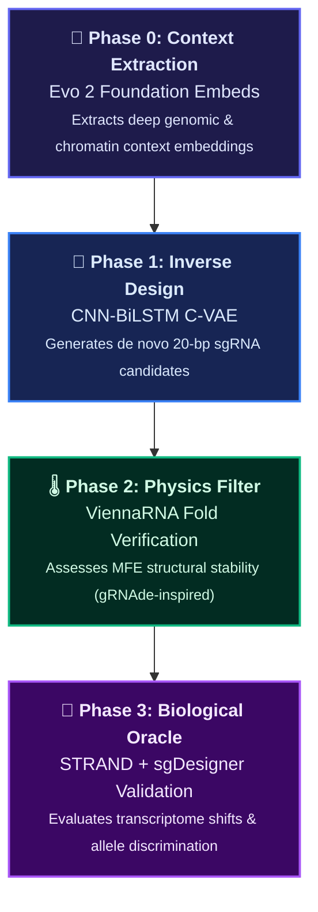

# 🧬 Generative Inverse Design of Allele-Specific sgRNAs for Autosomal Dominant Disorders

[](https://en.wikipedia.org/wiki/CRISPR)
[](#system-pipeline-architecture)
[](#️-infrastructure--workflow-strategy)

An end-to-end computational therapeutics framework leveraging a **Conditional Variational Autoencoder (C-VAE)** to solve the complex inverse problem of CRISPR-Cas9 single-guide RNA (sgRNA) engineering for allele-specific target modifications.

---

## 🗺️ System Pipeline Architecture

Our framework coordinates discrete biological constraints across four distinct operational phases, actively bridging macro-genomic foundation layers with deep generative modeling.



### Phase Details

* **Phase 0 (Feature Extraction)**: Extracts deep genomic and chromatin context embeddings from upstream foundation models (such as Evo 2).
* **Phase 1 (Inverse Design)**: Uses a specialized Hybrid CNN-BiLSTM C-VAE to read context condition vectors and mathematically generate *de novo* 20-bp single-guide RNA sequences.
* **Phase 2 (Geometric Physics Filtering)**: Assesses minimum free energy (MFE) structural constraints (inspired by gRNAde) to verify stable hairpin formations required for Cas9 assembly.
* **Phase 3 (Biological Oracle Validation)**: Routes generated candidate structures through predictive validation systems (inspired by STRAND and sgDesigner) to score single-cell transcriptomic shifts, off-target liabilities, and strict allele discrimination indices.

---

## ⚙️ Infrastructure & Workflow Strategy

To maximize reproducibility and hardware utilization, this project splits code orchestration and compute execution into a hybrid workflow:

| Environment | Primary Purpose / Responsibilities | Key Technologies / Hardware |
| :--- | :--- | :--- |
| **💻 Local Environment** | Repository management, documentation, data schemas, and pipeline layout. | Git, Python, local environment orchestration. |
| **☁️ Compute Environment** | Large-scale structural training of the C-VAE and multi-oracle evaluation loops. | **Kaggle Accelerator** (Cloud-hosted NVIDIA T4 GPUs). |

### 🚀 Running Training on Kaggle

Follow these steps to spin up the pipeline on Kaggle GPU instances:

1. **Clone the Repository**
   Pull the latest code directly into your Kaggle Notebook session:
   ```bash
   !git clone https://github.com/capybarawombat/lhp_sef_sgRNA.git
   ```
   *(Alternatively, configure a Git Repository import inside your Kaggle environment settings).*

2. **Upload Datasets**
   Upload your target genomic datasets as a zipped Kaggle Dataset asset and mount it to your running notebook.

3. **Train & Export**
   Execute the core training workflow script to export optimized model checkpoints (`.pth`) back into cloud storage.

---

## 📚 Core Literature Matrix & Reference Hub

The theoretical foundations of this project are directly built upon, contrasted with, and validated by the following peer-reviewed works:

| Reference / Paper | Authors & Year | Project Utility & Implementation | Resource Link |
| :--- | :--- | :--- | :--- |
| **STRAND**: Sequence-Conditioned Transport for Single-Cell Perturbations | Fu et al. (2026) | **Forward Evaluation Oracle**: Implements sequence-conditioned optimal transport to map baseline cell state distributions to perturbed distributions. | [arXiv:2602.10156v1](https://arxiv.org/abs/2602.10156v1) |
| **gRNAde**: Geometric Deep Learning for 3D RNA Inverse Design | Joshi et al. (2024) | **Structural Featurization & Multi-State Logic**: Uses multi-state conformation constraints to ensure generated sgRNAs maintain stable backbone structural integrity. | [PMC11142113](https://www.ncbi.nlm.nih.gov/pmc/articles/PMC11142113/) |
| **sgDesigner**: Generalizable sgRNA Design for Improved CRISPR/Cas9 Editing | Hiranniramol et al. (2020) | **Benchmarking Framework & Validation Design**: Establishes robust experimental baselines by generating 1,000 completely random, shuffled negative control sequences. | [Bioinformatics (Vol. 36)](https://doi.org/10.1093/bioinformatics/btaa222) |
