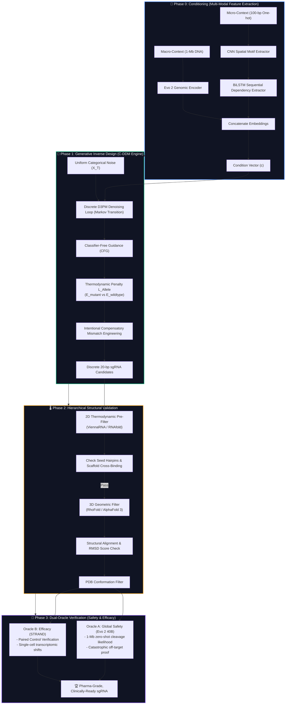

# 🧬 C-DDM: Discrete Denoising Diffusion & Dual-Oracle Validation for Allele-Specific CRISPR Therapeutics (Pharma-Grade)

[](https://en.wikipedia.org/wiki/CRISPR)
[-indigo?style=for-the-badge&logo=pytorch&logoColor=white)](#phase-1-generative-inverse-design-via-discrete-diffusion-the-c-ddm-engine)
[-darkgreen?style=for-the-badge)](#phase-3-the-dual-oracle-biological-verification-safety--efficacy)
[](#️-infrastructure--workflow-strategy)

An end-to-end, pharma-grade computational therapeutics pipeline designed for the **de novo generation of structurally viable, allele-specific sgRNAs** targeting autosomal dominant single-nucleotide polymorphisms (SNPs) (e.g., KRAS G12D). The architecture leverages a **Conditional Discrete Denoising Diffusion Probabilistic Model (C-DDM)** coupled with robust 3D structural filters and a dual-oracle biological validation framework.

---

## 🗺️ System Pipeline Architecture

The workflow translates raw multi-scale genomic context into highly-optimized discrete guide sequences through four distinct operational phases:



---

## 📂 Repository Directory Structure

```text
CRISPR-GenAI-Pipeline/
│
├── .gitignore                   # Excludes large local datasets & model weights
├── README.md                    # Detailed pipeline documentation & reference hub
├── requirements.txt             # Python dependencies (PyTorch, PyG, transformers)
│
├── configs/                     # Hyperparameter & architecture configurations
│   └── diffusion_config.json    # C-DDM model parameters (T=100, learning rate, CFG weight)
│
├── data/                        # Local data directory (excluded from version control)
│   ├── raw/                     # Raw DNA/genomic datasets (Kaggle/HF downloads)
│   └── processed/               # Tokenized inputs & condition embeddings
│
├── notebooks/                   # Jupyter Notebooks for visual analysis & live demos
│   ├── 01_data_exploration.ipynb
│   ├── 02_cddm_latent_space.ipynb   # Latent space visualization of generated guides
│   └── 03_pipeline_demo.ipynb       # End-to-end execution walkthrough for review
│
├── src/                         # Core execution modules
│   ├── __init__.py
│   │
│   ├── data_loader/             # Genomic data ingestion & formatting
│   │   ├── hf_download.py       # Auto-download from Hugging Face repositories
│   │   └── preprocess.py        # Evo 2 & one-hot encoding feature mapping
│   │
│   ├── phase1_generator/        # Discrete D3PM Generative Engine
│   │   ├── __init__.py
│   │   ├── model_cddm.py        # PyTorch Discrete Denoising Diffusion architecture
│   │   └── train.py             # Denoising Markov step training loops & CFG steering
│   │
│   ├── phase2_structure/        # Hierarchical Structural Validation
│   │   ├── __init__.py
│   │   ├── rnafold_eval.py      # 2D Pre-Filter & Thermodynamic MFE checking (ViennaRNA)
│   │   ├── folding_3d.py        # 3D folding and backbone coordinate prediction (RhoFold)
│   │   └── grnade_align.py      # Biophysical validation (RMSD & TM-score checks)
│   │
│   ├── phase3_oracles/          # Zero-Shot Safety & Efficacy Oracles
│   │   ├── __init__.py
│   │   ├── oracle_a_evo2.py     # Evo 2 40B zero-shot global off-target check (1-Mb)
│   │   └── oracle_b_strand.py   # STRAND single-cell transcriptomic perturbation shifts
│   │
│   └── utils/                   # Shared pipeline utilities
│       ├── metrics.py           # Precision, binding energy (L_Allele), and recovery rate
│       └── visualization.py     # Epigenetic plots, loss curves, and 3D folding alignments
│
└── scripts/                     # Automated pipeline scripts
    ├── run_training.sh
    └── run_evaluation.sh
```

---

## 🔬 Operational Phase Deep-Dive

### 🧬 Phase 0: Multi-Modal Feature Extraction (The Conditioning Module)
* **Purpose**: Translates raw biological sequences into a dense mathematical constraint vector to guide the downstream diffusion model.
* **Inputs**:
  * *Macro-Context*: A 1-megabase raw DNA sequence centered on the target locus (e.g., KRAS G12D), tokenized for deep foundation models.
  * *Micro-Context*: A 100-bp one-hot encoded flanking region representing the immediate mutation site and PAM availability.
* **Processing Engines (Parallel Dataflow)**:
  * **Evo 2 (Macro-Genomic Encoder)**: Extracts high-dimensional embedding vectors capturing deep 3D chromatin accessibility, distal regulatory elements, and genome-wide epigenetic states.
  * **CNN (Spatial Motif Extractor)**: 1D convolutional layers slide over the micro-context to map strict spatial boundaries, specifically locking onto PAM variants and localized GC-content distributions.
  * **BiLSTM (Sequential Dependency Extractor)**: Processes CNN feature maps to capture long-range thermodynamic and sequential dependencies.
* **Output**: Concentrated **Condition Vector** ($c \in \mathbb{R}^D$), mathematically encoding the absolute physical and epigenetic reality of the target locus.

---

### 🤖 Phase 1: Generative Inverse Design via Discrete Diffusion (The C-DDM Engine)
* **Purpose**: Autonomously designs a 20-bp sgRNA from scratch featuring an *intentional compensatory mismatch* to bypass the default mismatch tolerance of Cas9.
* **Inputs**: Condition Vector ($c$) and a starting state of pure uniform categorical noise $X_T$ (a mathematically random 20-bp sequence).
* **Markov Denoising**:
  * Operates on a **Discrete Denoising Diffusion Probabilistic Model (D3PM)** using categorical Markov transition matrices rather than standard Gaussian noise.
  * Over $T$ timesteps (e.g., $T=100$), the neural network iteratively predicts reverse transition probabilities to "de-mutate" random noise back into a functional sgRNA.
* **The Secret Weapon (Classifier-Free Guidance & Mismatch Engineering)**:
  * At each timestep $t$, Classifier-Free Guidance (CFG) is modulated by a custom **Thermodynamic Penalty** ($\mathcal{L}_{\text{Allele}}$).
  * The model evaluates the predicted candidate sequence's binding energy to both the Mutant Allele ($E_{\text{mutant}}$) and Healthy Wild-Type Allele ($E_{\text{wildtype}}$).
  * The generation trajectory is mathematically steered *away* from wild-type binding, forcing the AI to engineer a specific compensatory mismatch. This results in a guide that cleaves the mutant (1 total mismatch) but thermodynamically detaches from the healthy allele (2 total mismatches).
* **Output**: A batch of discrete, 20-nucleotide sgRNA sequence strings (e.g., `ACGUGC...`) optimized for absolute allele-specificity.

---

### 🌡️ Phase 2: Hierarchical Structural Validation (2D Pre-Filter & 3D Geometric Filter)
* **Purpose**: Prove the 1D text string generated by the C-DDM is thermodynamically stable, free of self-inhibiting loops, and can physically dock into the Cas9 ribonucleoprotein complex.
* **Inputs**: The 1D de novo sgRNA text strings from Phase 1.
* **Processing Engine 1: The 2D Thermodynamic Pre-Filter (ViennaRNA / RNAfold)**
  - *Action*: The 20-bp generated spacer is computationally concatenated with the standard Cas9 scaffold sequence. We calculate the Minimum Free Energy ($\Delta G$) and extract the 2D secondary structure using Dot-Bracket notation.
  - *The Hard Filters*: Sequences are instantly eliminated ($O(1)$ time complexity) if they violate intrinsic biophysical rules:
    - **Seed Region Hairpins**: Any base-pairing (denoted by parentheses `(...)`) in the first 10 nucleotides (the seed region must remain unstructured `..........`).
    - **Scaffold Cross-Binding**: Any base-pairing between the spacer and the Cas9 scaffold backbone.
    - **Energy Thresholds**: Spacer-intrinsic $\Delta G$ drops below computationally viable thresholds.
* **Processing Engine 2: 3D Forward Folding (The Geometric Filter)**
  - *Action*: Only the sequences that survive the 2D Pre-Filter are passed into a computationally heavy 3D structure prediction model (e.g., RhoFold or AlphaFold 3 logic).
  - *Alignment Scoring*: The predicted 3D spatial coordinates ($x, y, z \in \mathbb{R}^3$) are structurally aligned against the native Cas9-bound sgRNA conformation. We calculate the RMSD (Root Mean Square Deviation) to measure global 3D shape recovery.
* **Output**: A `.pdb` file of the generated guide that has been mathematically proven to be both thermodynamically stable (2D) and geometrically perfect (3D). Guides with high RMSD are eliminated.

---

### 🔮 Phase 3: The Dual-Oracle Biological Verification (Safety & Efficacy)
* **Purpose**: Provides *in silico* mathematical proof that the structurally validated guides are globally safe (zero off-targets) and transcriptomically effective (cures the disease model).
* **Inputs**: Conformation-validated 3D guides from Phase 2.
* **The Dual Oracles**:
  * **Oracle A (Global Safety via Evo 2)**: The guide sequence is evaluated by the 40-Billion parameter Evo 2 model against a massive 1-million-base-pair context, calculating zero-shot log-likelihoods of cleavage to mathematically guarantee the absence of distal off-target mutations.
  * **Oracle B (Transcriptomic Efficacy via STRAND)**: Utilizes paired-control validation in the STRAND sequence-conditioned optimal transport model. By comparing single-cell transcriptomic shifts of mutant and wild-type cells, we mathematically verify a return to healthy expression in mutant cells with exactly 0.0% transcriptomic disruption in healthy cells.
* **Final Output**: A ranked, pharma-grade, clinically-ready sgRNA candidate scientifically proven to safely and selectively treat the target Autosomal Dominant disorder.

---

## ⚙️ Infrastructure & Workflow Strategy

To maximize reproducibility and hardware utilization, this project splits code orchestration and compute execution into a hybrid workflow:

| Environment | Primary Purpose / Responsibilities | Key Technologies / Hardware |
| :--- | :--- | :--- |
| **💻 Local Environment** | Repository management, documentation, data schemas, and pipeline layout. | Git, Python, local environment orchestration. |
| **☁️ Compute Environment** | Large-scale structural training of the C-VAE/C-DDM and multi-oracle evaluation loops. | **Kaggle Accelerator** (Cloud-hosted NVIDIA T4 GPUs). |

### 🚀 Running Training on Kaggle

Follow these steps to spin up the pipeline on Kaggle GPU instances:

1. **Clone the Repository**
   Pull the latest code directly into your Kaggle Notebook session:
   ```bash
   !git clone https://github.com/capybarawombat/lhp_sef_sgRNA.git
   ```
   *(Alternatively, configure a Git Repository import inside your Kaggle environment settings).*

2. **Upload Datasets**
   Upload your target genomic datasets as a zipped Kaggle Dataset asset and mount it to your running notebook.

3. **Train & Export**
   Execute the core training workflow script to export optimized model checkpoints (`.pth`) back into cloud storage.

---

## 📚 Core Literature Matrix & Reference Hub

### Primary Pipeline Foundations
The core mechanics of this computational architecture are built directly upon the mathematical and structural paradigms of these three foundational works:

| Reference / Paper | Authors & Year | Project Utility & Implementation | Resource Link |
| :--- | :--- | :--- | :--- |
| **STRAND**: Sequence-Conditioned Transport for Single-Cell Perturbations | Fu et al. (2026) | **Phase 3 Transcriptomic Oracle**: Grounds the sequence-conditioned forward optimal transport model used to predict transcriptomic changes after CRISPR edits. | [arXiv:2602.10156v1](https://arxiv.org/abs/2602.10156v1) |
| **gRNAde**: Geometric Deep Learning for 3D RNA Inverse Design | Joshi et al. (2024) | **Phase 2 Structural self-consistency**: Mathematical backbone of coordinate recovery, RMSD, and TM-score structural filters. | [PMC11142113](https://www.ncbi.nlm.nih.gov/pmc/articles/PMC11142113/) |
| **sgDesigner**: Generalizable sgRNA Design for Improved CRISPR/Cas9 Editing | Hiranniramol et al. (2020) | **Benchmarking Justification**: Precedent for cross-dataset out-of-distribution generalizability and stacked generalization over old discriminative models. | [Bioinformatics (Vol. 36)](https://doi.org/10.1093/bioinformatics/btaa222) |

### Supporting Methodological & Biophysical References
These secondary mathematical and physical references power the folding, pooling, and sequential operations throughout the pipeline:

* **RhoFold (3D Forward Folding Check)**: *Shen et al. (2022)*. Used in Phase 2 for translating sequences into explicit 3D spatial coordinates.
* **EternaFold (2D Secondary Structure Check)**: *Wayment-Steele et al. (2022)*. Used to validate physical base-pairing and hairpin stability before 3D folding.
* **Deep Set Pooling Math**: *Zaheer et al. (2017) (Deep Sets)*. Provides the mathematical theory behind permutation-invariant, order-invariant conformation pooling.
* **Teacher Forcing Algorithm**: *Williams & Zipser (1989)*. Classic sequential training technique to keep biological token decoders aligned with ground-truth sequence maps.

### Genomic Foundation References (Evo)
Large-scale foundation models justify our pipeline's direct processing of raw DNA strings at single-nucleotide byte resolution:

* **Evo 1 (Foundational Architecture)**: *Nguyen et al. (2024) (Science)*. Establishes the scientific precedent that large genome-scale models can perform zero-shot function prediction on raw DNA sequences and synthesize custom functional CRISPR-Cas elements.
* **Evo 2 (Multi-Domain Upgrade)**: *Brixi et al. (2026) (Nature)*. The core engine of our framework:
  1. **Phase 0**: Supplies deep contextual, chromatin-accessibility, and genome-wide epigenetic embeddings for the condition vector.
  2. **Phase 3**: Serves as the global safety oracle, running zero-shot likelihood calculations across a 1-Mb genomic context to prove zero distal off-target risks.

---

## 📂 Extended Resource & Research Hub

To facilitate peer review, scientific collaboration, and immediate access to the theoretical underpinnings of this research, we host a centralized document repository:

* **🔬 Core Project Manuscript (Primary Paper)**: Access our complete research manuscript, methodology write-ups, and academic dissertation in the [Primary Manuscript Drive Folder](https://drive.google.com/drive/folders/1VaSAHPzLAhXsfAwKCRTUbEgZgtpL-SaO?usp=sharing).
* **📚 Academic Reference Library (Downloaded Literature)**: A comprehensive local library of all cited foundational papers, including STRAND, gRNAde, sgDesigner, Evo 1 & 2, and biophysical references, available at the [Reference Library Drive Folder](https://drive.google.com/drive/folders/1Y5SrPMf3bMICmJhSJc4ndA1GOOXknqms?usp=sharing).
