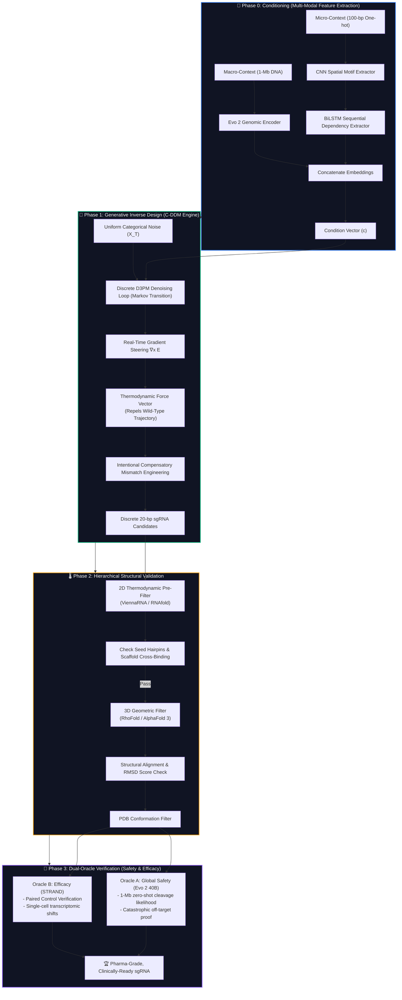

# 🧬 MAGE-CRISPR: Energy-Guided Discrete Diffusion & Dual-Oracle Validation for Allele-Specific Therapeutics (Pharma-Grade)

[-indigo?style=for-the-badge&logo=pytorch&logoColor=white)](#phase-1-generative-inverse-design-via-discrete-diffusion-the-c-ddm-engine)
[-darkgreen?style=for-the-badge)](#phase-3-the-dual-oracle-biological-verification-safety--efficacy)

An end-to-end, pharma-grade computational therapeutics pipeline designed for the **de novo generation of structurally viable, allele-specific sgRNAs** targeting autosomal dominant single-nucleotide polymorphisms (SNPs) (e.g., KRAS G12D). The architecture leverages a **Conditional Discrete Denoising Diffusion Probabilistic Model (C-DDM)** guided by real-time thermodynamic gradients, coupled with robust 3D structural filters and a dual-oracle biological validation framework.

---

## 🗺️ System Pipeline Architecture

The workflow translates raw multi-scale genomic context into highly-optimized discrete guide sequences through four distinct operational phases. Unlike traditional post-generation filtering, our model utilizes mathematical force vectors to steer the AI during the generation process itself.

